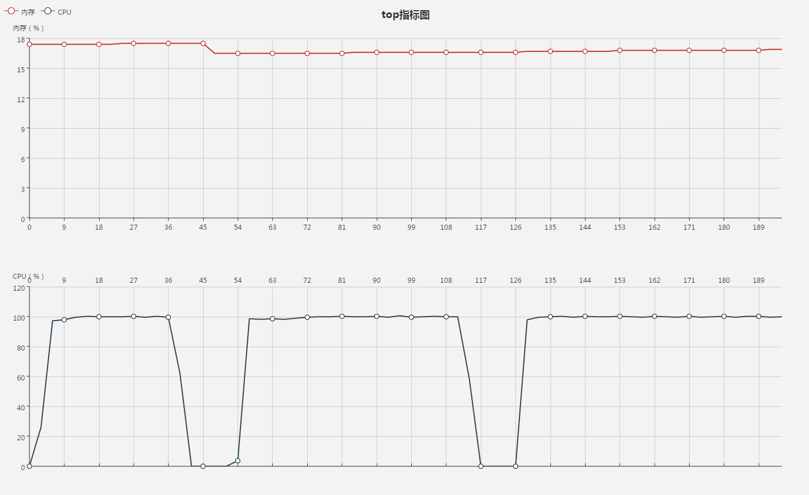

# 测试环境
## 基本信息：
    Linux l-node3.des.dev.cn0 2.6.32-358.23.2.el6.x86_64 #1 SMP Wed Oct 16 18:37:12 UTC 2013 x86_64 x86_64 x86_64 GNU/Linux

## 操作系统：
    CentOS release 6.4 (Final)

## 内存：
    MemTotal:        3922688 kB

## CPU-四核0~3：
    processor       : 0
    vendor_id       : GenuineIntel
    cpu family      : 6
    model           : 42
    model name      : Intel Xeon E312xx (Sandy Bridge)
    stepping        : 1
    cpu MHz         : 2599.998
    cache size      : 4096 KB
    fpu             : yes
    fpu_exception   : yes
    cpuid level     : 13
    wp              : yes
    flags           : fpu vme de pse tsc msr pae mce cx8 apic sep mtrr pge mca cmov pat pse36 clflush mmx fxsr sse sse2 ss syscall nx pdpe1gb lm constant_tsc unfair_spinlock pni pclmulqdq ssse3 cx16 pcid sse4_1 sse4_2 x2apic popcnt tsc_deadline_timer aes xsave avx f16c rdrand hypervisor lahf_lm xsaveopt fsgsbase smep
    bogomips        : 5199.99
    clflush size    : 64
    cache_alignment : 64
    address sizes   : 46 bits physical, 48 bits virtual

## 另：
    LINUX 文件描述符限制：ulimit -n = 65536

# 测试编译性能
## 使用模板生成如下的文件：
    /*@Controller*/
    module.exports = {
        /*@RequestMapping(["/aaayMmNYsf/a"])*/
        a: function(req, res) {
            res.end("aaayMmNYsf/a");
        }
    }

|生成文件数|内存占用|启动时间
| --------|:-------:|:------:|
|100        |1.1%|  110ms|
|1000       |1.1%|  406ms|
|10000      |3.9%|  3160ms|
|50000      |16.7%| 14144ms|
|100000     |EMFILE(超过文件描述符限制打开文件数目，启动失败)| --|

启动时的内存状态在x_1.heapsnapshot,即总共x个文件，文件中有1个controller,可以在chrome开发工具中打开查看。

# 测试并发性能
## 工具
webbench  version:1.5
## 过程
在上述环境50000文件下进行30s的并发测试（所有压测下的请求均未见失败）

|时间点 |并发客户端（-c）|本地浏览请求等待时间  |速度|
| --------|:-------:|:------------:|:-------------------:|
|1s|100|5.87s|1028 pages/min, 1884 bytes/sec|
|50s|500|28.34s|1002 pages/min, 1837 bytes/sec|
|125s|1000|29.57s|956 pages/min, 1752 bytes/sec|

## 结果
服务器性能如下：
